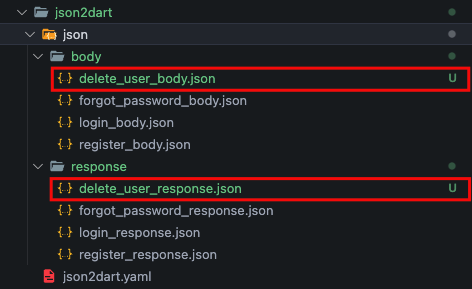

# Json to Dart
## Json to Dart
This command is used to generate the API based on the configuration json file in the `json2dart/json2dart.yaml` file
```bash
gits json2dart
```

:::info

The generated API will be available according to the features and pages that we configure.

:::

:::note json2dart.yaml Configuration
To add API we have to add this following line:

```yaml
feature_name:
    page_name:
        api_name:
            path: endpoint_name
            method: your_api_method
            body: url_file_body_json
            response: url_file_response_json
            header: url_file_hearder_json // optional
```

Extra notes:
- We can add more than one api on a page.
- Allowed methods: get, post, put, patch, delete & multipart.
- Options : (We need to add this manually)
  ```yaml
    json2dart:
        body_format_date_time: yyyy-MM-dd // default is .toIso8601String()
        response_format_date_time: yyyy-MM-dd HH:mm // default is .toIso8601String()
        nullable: true // default is true
        equatable: true // default is true
        final: true // default is true
        required: true // default is true
        api: true // default is true
        endpoint: true // default is true
        unit-test: true // default is true
        replace: true // default is true
    ```
:::

For example, we will add the delete user API to page users in the master feature using json2dart, here are the steps:
1. Add json files for "response" and "body" API, response json files in `json2dart/json/response/`, for body json files `json2dart/json/body/`

    

    ```json title="json2dart/json/body/delete_user_body.json"
    {
        "id_user":"id_user"
    }
    ```

    ```json title="json2dart/json/response/delete_user_response.json"
    {}
    ```

2. Add the delete_user API configuration to the `json2dart/json2dart.yaml` file
   
   

3. Generate API with this command
    ```bash
    gits json2dart
    ```
    The delete user API is automatically added to page users in the feature master, after that we need to add the BLoC to our Cubit.


## Endpoint
This command is used to generate endpoints in the file `core/lib/src/constants/src/gits_endpoints.dart` based on the endpoints in the file `json2dart/json2dart.yaml`
```bash
gits endpoint
```