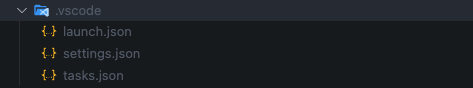

# Config
:::caution

This command is specific to VSCode IDE user.
:::

```bash
gits config
```
This command is used to generate the `.vscode/launch.json` and `.vscode/task.json` files according to the configuration in the `gits.yaml` file.

