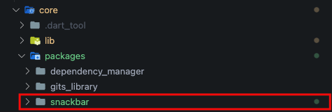

# Custom Package
This command is used if we want to add a custom package to core.
```bash
gits core [package_name]
```
for the example of adding the snackbar package:
```bash
gits core snackbar
```
We can check the generated results in `core/lib/packages/snackbar`.

