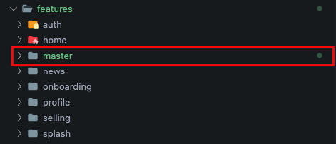

# Feature

This command is used to generate new feature
```bash
git feature [feature_name]
```
for the example we will generate a new feature named master
```bash
gits feature master
```
The feature master folder will be created automatically, we can check in `features/master/`



:::caution

The feature will not be generated if the feature name we enter already exists.
:::