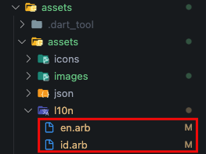
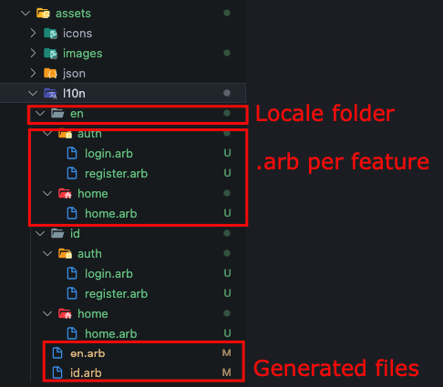

# l10n (Languages)

## Single .arb
We can create multilingual systems with single .arb

   

## Spesific .arb
We can create multilingual systems with specific .arb based on our features for easy maintenance with this structure:

   

:::caution

We are unable to combine single and specific.arb ! 

:::

## Generate The Languages

This command is used to generate the l10n file at the path `assets/assets/l1on/` so that we can use it in the project.
```bash
gits l10n
```

:::tip

- Use this command when there is a change in the l10n file.
- Especially for vscode users, to make it easier to process l10n files, we can use the extension **[i10n arb editor](https://marketplace.visualstudio.com/items?itemName=innwin.i18n-arb-editor)**, don't forget to save and use the command above after making changes. (This tips only works for non spesific `.arb` or single `.arb` file)

:::