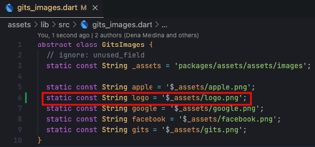

# Assets

This command is used to generate our asset file as a constant.

```bash
gits assets
```

Here are the steps for creating a logo.png image file as an example:

1. Add the logo files to the `assets/assets/images/` folder

   

2. Generate constants with the command:

    ```bash
    gits assets
    ```

    The logo constant will be generated in the `core/assets/lib/gits_images.dart` file

    

:::info

Adjust the placement of the assets that we use

- Image file path `assets/assets/images/` constant will be generated in the file `core/assets/lib/gits_images.dart`
- The file path icon `assets/assets/icons/` constant will be generated in the file `core/assets/lib/gits_icons.dart`
- The path of the json file `assets/assets/json/` constant will be generated in the file `core/assets/lib/gits_json.dart`
  
:::

## Options

```bash
gits assets [arguments]
```

To see all available options and flags, run `gits assets --help`.

### Available Options

- Custom Gits Yaml :

| Custom Gits Yaml | Description |
|----------|-------------|
| `--gits-yaml [path_file]` | This command is used to select yaml config the application in a specific file, by default it will run the `gits.yaml` file. |
