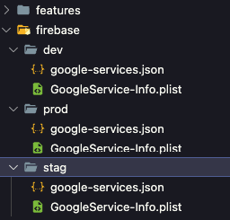

# Firebase

This command is used to move firebase file `google services` in the`firebase/` folder to each platform folder.

```bash
gits firebase
```

:::caution
Ensure that the `google-services.json` file and the `GoogleService-Info.plist` file in the `firebase/` folder are aligned

 
:::

## Options

```bash
gits firebase [arguments]
```

To see all available options and flags, run `gits firebase --help`.

### Available Options

- Custom Gits Yaml :

| Custom Gits Yaml | Description |
|----------|-------------|
| `--gits-yaml [path_file]` | This command is used to select yaml config the application in a specific file, by default it will run the `gits.yaml` file. |

- Flavor/Environment :  
  
| Flavor/Environment | Alternative | Description |
|----------|-------------|-------------|
| `-f dev` | `--flavor dev` | Run project on dev environment (Default) |
| `-f stag` | `--flavor stag` | Run project on staging environment|
| `-f prod` | `--flavor prod` | Run project on production environment |
