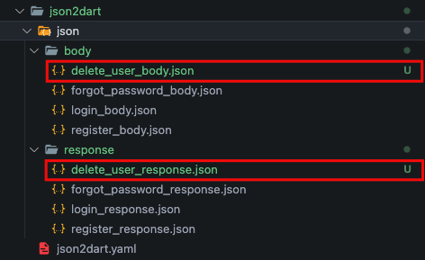

# Json to Dart

This command is used to generate the API based on the configuration json file in the `json2dart/json2dart.yaml` file

```bash
gits json2dart
```

:::info

The generated API will be available according to the features and pages that we configure.

:::

:::note json2dart.yaml Configuration
To add API we have to add this following line:

```yaml title="json2dart/json2dart.yaml"
feature_name:
    page_name:
        api_name:
            path: endpoint_name
            method: your_api_method
            body: url_file_body_json
            response: url_file_response_json
            header: url_file_hearder_json // optional
            cache_stategy: cache_stategy // optional
```

Cache Strategy :

Inside json2dart.yaml there are `cache_strategy` allow additions: `async_or_cache`, `cache_or_async`, `just_async`, `just_cache`. by default set to `just_async`.

- `async_or_cache` : strategy to fetch the api first and cache the response. if fetch fails it will return data from cache.
- `cache_or_async` : strategy if there is data in the cache and it is not expired then it will return data from the cache first. otherwise it will fetch api and responsen will be cached.
- `just_async` : a strategy that only fetches the api to get the data.
- `just_cache` : a strategy that only gets data from cache.

```yaml title="Simple Implementation"
cache_strategy: async_or_cache
```

```yaml title="Detail Implementation"
cache_strategy: 
  strategy: async_or_cache
  ttl: 60 #in Minutes
  keep_expired_cache: true 
```

Extra notes:

- We can add more than one api on a page.
- Allowed methods: get, post, put, patch, delete & multipart.
- Options : (We need to add this manually)

  ```yaml title="json2dart/json2dart.yaml"
    ...
    json2dart:
        body_format_date_time: yyyy-MM-dd // default is .toIso8601String()
        response_format_date_time: yyyy-MM-dd HH:mm // default is .toIso8601String()
        nullable: true // default is true
        equatable: true // default is true
        final: true // default is true
        required: true // default is true
        api: true // default is true
        endpoint: true // default is true
        unit-test: true // default is true
        replace: true // default is true
    ...
    ```

:::

For example, we will add the delete user API to page users in the master feature using json2dart, here are the steps:

1. Add json files for "response" and "body" API, response json files in `json2dart/json/response/`, for body json files `json2dart/json/body/`

    

    ```json title="json2dart/json/body/delete_user_body.json"
    {
        "id_user":"id_user"
    }
    ```

    ```json title="json2dart/json/response/delete_user_response.json"
    {}
    ```

2. Add the delete_user API configuration to the `json2dart/json2dart.yaml` file

    ```yaml title="json2dart/json2dart.yaml"
    json2dart:
        body_format_date_time: yyyy-MM-dd
        response_format_date_time: yyyy-MM-dd HH:mm
        nullable: true
        equatable: true
        final: true
        required: true
        api: true
        endpoint: true
        unit-test: true
        replace: true

    auth: # feature-name
        login: # page-name
            login: # api-name
            path: /login
            method: post
            body: json2dart/json/body/login_body.json
            response: json2dart/json/response/login_response.json
            cache_strategy: async_or_cache
        register: # page-name
            register: # api-name
            path: /register
            method: post
            body: json2dart/json/body/register_body.json
            response: json2dart/json/response/register_response.json
            cache_strategy:
                strategy: cache_or_async
                ttl: 60
        forgot_password: # page-name
            forgot_password: # api-name
            path: /forgot_password
            method: get
            body: json2dart/json/body/forgot_password_body.json
            response: json2dart/json/response/forgot_password_response.json
            cache_strategy:
                strategy: just_cache
                ttl: 120
                keep_expired_cache: true
    # Add delete user
    master: # page-name
        users: # page-name
            delete_user: # api-name
            path: /delete_user
            method: delete
            body: json2dart/json/body/delete_user_body.json
            response: json2dart/json/response/delete_user_response.json
            cache_strategy: just_async
    ```

3. Generate API with this command

    ```bash
    gits json2dart
    ```

    The delete user API is automatically added to page users in the feature master, after that we need to add the BLoC to our Cubit.

## Options

```bash
gits json2dart [arguments]
```

To see all available options and flags, run `gits json2dart --help`.

### Available Options

- Custom Gits Yaml :

| Custom Gits Yaml | Description |
|----------|-------------|
| `--gits-yaml [path_file]` | This command is used to select yaml config the application in a specific file, by default it will run the `gits.yaml` file. |

- Specific Feature :  
  
| Specific Feature | Alternative | Description |
|----------|-------------|-------------|
| `-f [feature-name]` | `--feature-name [feature-name]` | Generate json2dart spesific feature which has been registered in `json2dart/json2dart.yaml` |

- Specific Page :  
  
| Specific Page | Alternative | Description |
|----------|-------------|-------------|
| `-p [page-name]` | `--page-name [page-name]` | Generate json2dart spesific page which has been registered in `json2dart/json2dart.yaml` must include `--feature-name` option |

- Flags :
  
| App Version | Description |
|----------|-------------|
| `--[no-]nullable` | Set generated variable to nullable. (defaults to on) |
| `--[no-]equatable` | Set generated extends class with Equatable. (defaults to on) |
| `--[no-]final` | Set generated variable to final. (defaults to on) |
| `--[no-]required` | Set generated variable constructor to required. (defaults to on) |
| `--[no-]api` | Set generated models with implement api. (defaults to on) |
| `--[no-]unit-test` | Generate unit test for api implementation. (defaults to on) |
| `--[no-]endpoint` | Generate endpoint from path json2dart.yaml. (defaults to on) |
| `--[no-]replace` | Replace value generated. if set to false will be delete all directory generated json2dart before. (defaults to on) |
