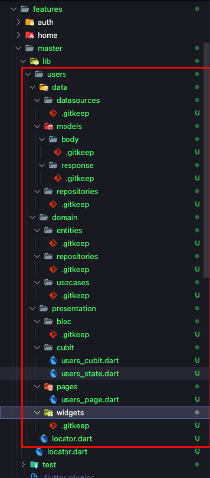

# Page

This command is used to generate page in a feature.

```bash
gits page [page_name] -f [feature_name]
```

for the example we will create page users on the feature master

```bash
gits page users -f master
```

The page users folder will be generated in `features/master/lib/users` automatically.



:::caution

Page will not be generated if:

- The feature that we enter does not exist
- The page name we entered already exists

:::
