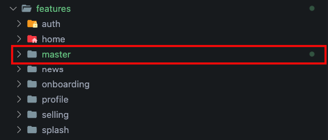

# Feature

In a modular system, features will be made in separate packages and isolated from other features.

:::caution

features not allowed to depend on other features. Except for the `core` and `master` feature which can be allowed to be used by other features.

:::

## Generate Feature

To generate features you can follow these steps:

```bash
gits feature [feature_name]
```

for the example we will generate a new feature named master

```bash
gits feature master
```

The feature master folder will be created automatically, we can check in `features/master/`



:::caution

The feature will not be generated if the feature name we enter already exists.

:::

Learn more about `gits feature` [here](../gits_cli/generate/feature)

### What is Generated

1. Feature Master

    ```console title="Folder Structure"
    ┌── ...
    ├── features                                    # Modules feature directory
    │   ├── ...                                  
    │   ├── master                                  # Master's modules
    │   │   ├── lib                          
    │   │   │   ├── locator.dart                    # Service locator master (auto generated, not allow to editable)  
    │   │   ├── test                               
    │   │   │   ├── .gitkeep                        # Keep this directory in repository
    │   │   ├── .gitignore                          
    │   │   ├── .metadata                          
    │   │   ├── analysis_options.yaml                          
    │   │   ├── CHANGELOG.md                          
    │   │   ├── LICENSE                          
    │   │   ├── pubspec.yaml                          
    │   │   ├── README.md                          
    └── ...
    ```

2. Auto add dependency in main `pubspec.yaml`

    ```yaml title="pubspec.yaml"
    name: gits_flutter_starter_kit
    description: A new Flutter project.
    publish_to: "none"

    version: 2.5.0+1

    environment:
    sdk: ">=2.17.0 <3.0.0"

    dependencies:
    flutter:
        sdk: flutter

    core:
        path: ./core
    splash:
        path: ./features/splash
    onboarding:
        path: ./features/onboarding
    auth:
        path: ./features/auth
    home:
        path: ./features/home
    news:
        path: ./features/news
    profile:
        path: ./features/profile
    selling:
        path: ./features/selling
    master:                                     # Added this generate
        path: ./features/master                 # Added this generate

    dev_dependencies:
    integration_test:
        sdk: flutter
    flutter_test:
        sdk: flutter
    flutter_lints: ^2.0.1
    gits_cucumber: ^1.2.1

    flutter:
    uses-material-design: true
    assets:
        - integration_test/ndjson/
    ```

3. Auto add setupLocatorFeature in `lib/locator.dart`

    ```dart
    //
    // Generated file. Edit just you manually add or delete a feature.
    //

    import 'package:auth/locator.dart';
    import 'package:core/core.dart';
    import 'package:home/locator.dart';
    import 'package:master/locator.dart';
    import 'package:news/locator.dart';
    import 'package:onboarding/locator.dart';
    import 'package:profile/locator.dart';
    import 'package:selling/locator.dart';

    import 'routes/routes.dart';

    void setupLocator() {
      locator.registerLazySingleton(() => Routes.router);
      setupLocatorFeatureCore();
      setupLocatorFeatureAuth();
      setupLocatorFeatureOnboarding();
      setupLocatorFeatureHome();
      setupLocatorFeatureNews();
      setupLocatorFeatureProfile();
      setupLocatorFeatureSelling();
      setupLocatorFeatureMaster();                // Added this generate
    }
    ```
